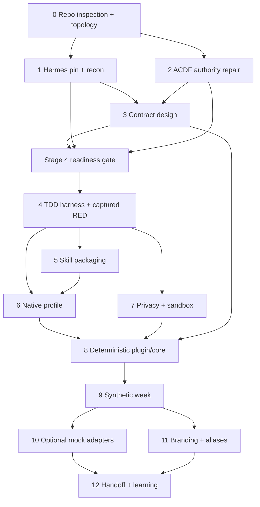

# Dependency Map

```mermaid
flowchart TD
    P0["0 Repo inspection + topology"] --> P1["1 Hermes pin + recon"]
    P0 --> P2["2 ACDF authority repair"]
    P1 --> P3["3 Contract design"]
    P2 --> P3
    P3 --> R4["Stage 4 readiness gate"]
    P1 --> R4
    P2 --> R4
    R4 --> P4["4 TDD harness + captured RED"]
    P4 --> P5["5 Skill packaging"]
    P4 --> P6["6 Native profile"]
    P4 --> P7["7 Privacy + sandbox"]
    P5 --> P6
    P6 --> P8["8 Deterministic plugin/core"]
    P7 --> P8
    P3 --> P8
    P8 --> P9["9 Synthetic week"]
    P9 --> P10["10 Optional mock adapters"]
    P9 --> P11["11 Branding + aliases"]
    P10 --> P12["12 Handoff + learning"]
    P11 --> P12
```

No Phase 8 production module may begin without its Phase 4 failing test receipt. Upstream upgrades are outside this graph and begin only after F1.
