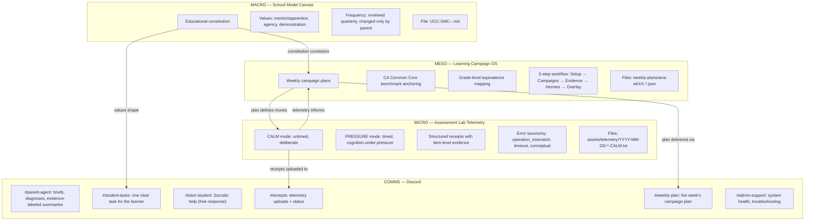
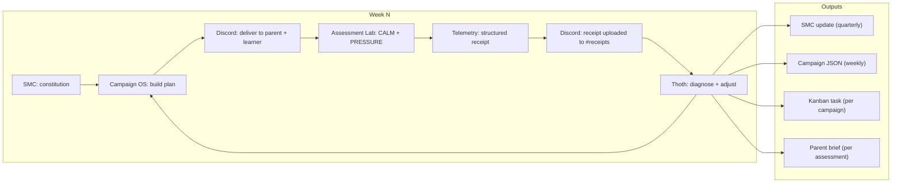
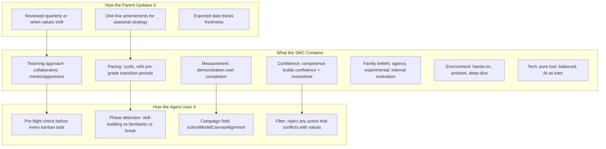
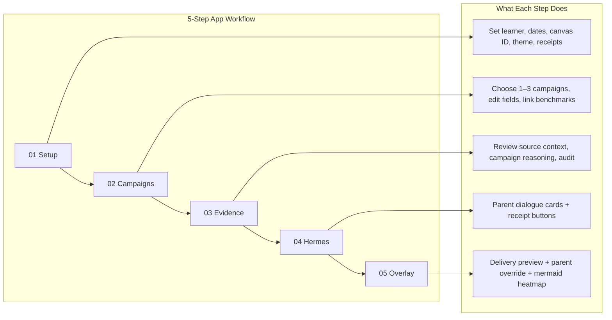
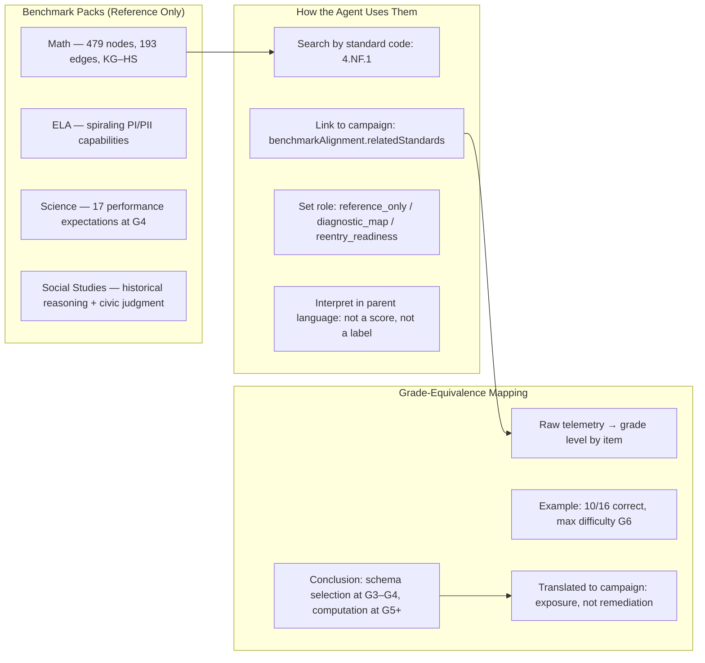
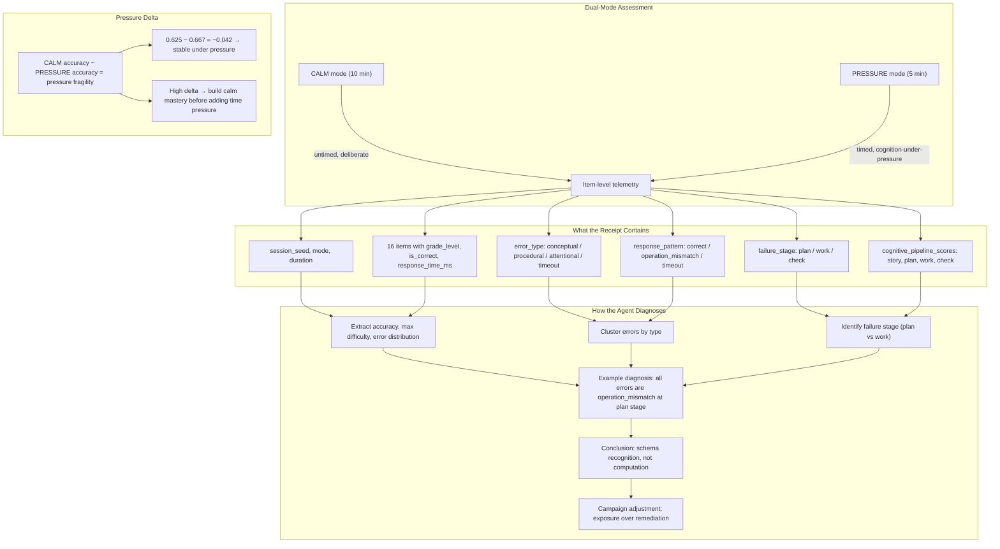
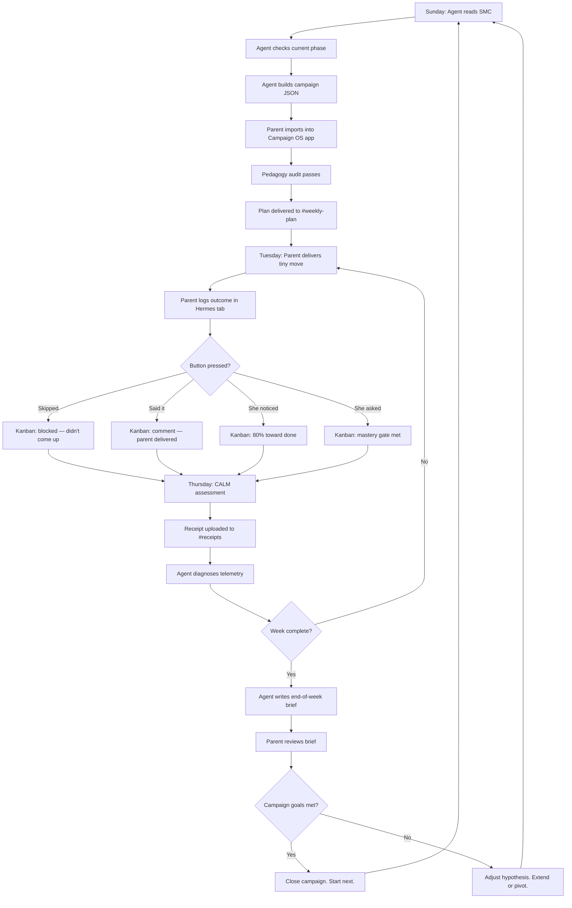
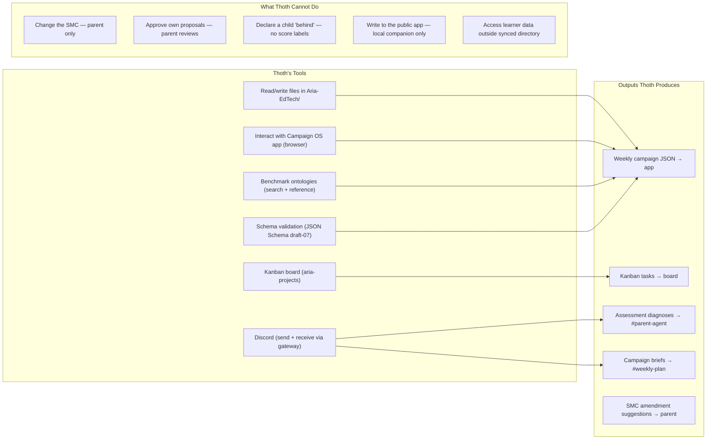
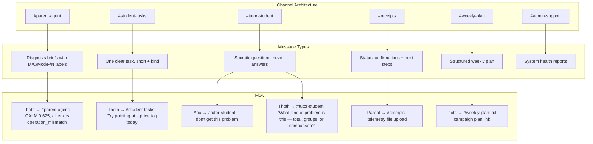
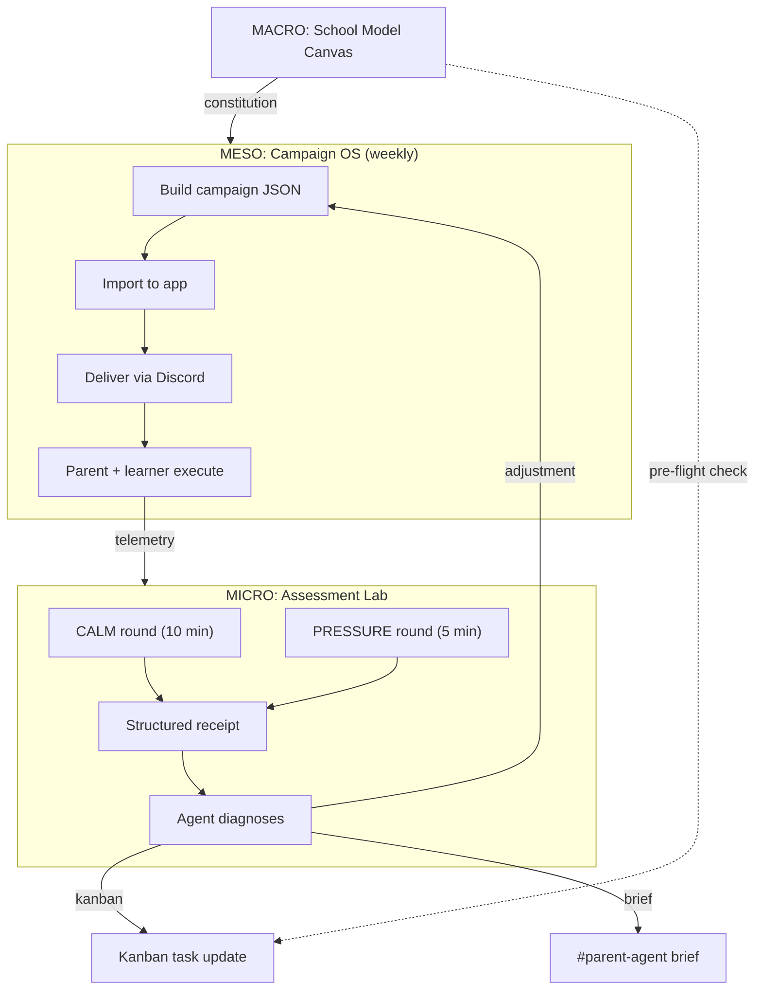

# Macro-Meso-Micro Loop

> How the **Hermes Thrice Great** agent (individual name: **Thoth**) orchestrates a family's learning system across three layers — constitution, campaign, and evidence — connected through a private Discord server.

---

## 1. The Three-Layer Architecture



**Macro** = the constitution. Changes rarely. Set by the parent.

**Meso** = the campaign. Changes weekly. Designed by the agent, approved by the parent.

**Micro** = the evidence. Changes daily. Produced by the learner, interpreted by the agent.

**Comms** = the connective tissue. Every layer communicates through Discord channels.

---

## 2. The Core Loop



Each week: plan → execute → assess → diagnose → adjust. The loop runs at the speed of one week.

---

## 3. File System Layout

```
Aria-EdTech/
│
├── UCC-SMC-Aria-2026-06-07.md          ← MACRO: the constitution
│
├── weekly-plans/                        ← MESO: campaign plans
│   ├── aria-wk01-fractions-decimals.json
│   ├── aria-wk02-weathering-erosion.json
│   ├── aria-wk03-california-geography.json
│   ├── aria-wk04-ela-opinion-text.json
│   ├── aria-wk05-multi-digit-multiplication.json
│   ├── aria-wk06-energy-waves.json
│   └── aria-wk07-wrapup-catchup.json
│
├── assets/telemetry/                    ← MICRO: assessment evidence
│   ├── 2026-06-25-algebra-readiness-aria-CALM.txt
│   └── 2026-06-25-algebra-readiness-aria-PRESSURE.txt
│
├── benchmarks/                          ← CA Common Core reference terrain
│   ├── ca_common_core_math/
│   ├── ca_common_core_ela/
│   ├── ca_science/
│   └── ca_social_studies/
│       ├── ontology/standards_nodes.json
│       ├── ontology/prerequisite_edges.json
│       └── markdown/grade_4.md
│
├── ucc-sprint-fable/                    ← App source + schemas
│   └── schemas/
│       ├── weekly_campaign_plan.schema.json
│       ├── receipt.schema.json
│       └── hermes_task_card.schema.json
│
├── UCC_learning_campaign_suggested_updates.md
│
└── docs/
    ├── runbook.md
    └── owners_manual.md
```

---

## 4. How the School Model Canvas Works (Macro)



**The SMC is not a plan. It is a decision filter.** Every campaign, every kanban task, every assessment mode is checked against it before execution.

---

## 5. How the Learning Campaign OS Works (Meso)



### California Common Core Anchoring



**Benchmarks inform. They do not command.** The packs are reference terrain — they tell the agent which grade-level concepts exist, but the SMC decides whether and how to pursue them.

---

## 6. How the Assessment Lab Works (Micro)



**The pressure delta is the single most informative metric.** A large gap between CALM and PRESSURE accuracy means the learner knows the material but can't access it under time stress. A zero or negative gap means the bottleneck is elsewhere (in Aria's case: schema selection, not pressure).

---

## 7. The Full Weekly Workflow



---

## 8. How Thoth (the Agent) Fits



**Thoth is an orchestrator and interpreter — not the final authority.** The parent reviews, accepts, rejects, or overrides every proposal. The agent's power is in pattern recognition (spotting the operation_mismatch cluster across 16 items) and translation (turning 500 lines of telemetry JSON into a one-sentence campaign hypothesis).

---

## 9. Communication Through Discord



### Channel Roles

| Channel | Speaker → Listener | Tone | @mention Required? |
|---------|-------------------|------|-------------------|
| #parent-agent | Thoth → Parent | Evidence-labeled, calm, unsentimental | Yes |
| #student-tasks | Thoth → Learner | Short, warm, one task at a time | Yes |
| #tutor-student | Learner ↔ Thoth | Socratic, questions-only | No (free response) |
| #receipts | Any → Thoth | Status + next step | No (free response) |
| #weekly-plan | Thoth → All | Structured plan format | Yes |
| #admin-support | Thoth → Parent | Technical, tables | Yes |

---

## 10. Summary: What a New Family Needs to Replicate

To set up their own Hermes Thrice Great agent with the same system:

| Component | What They Need | Provided By |
|-----------|---------------|-------------|
| **Agent** | Hermes-compatible AI runtime | Hermes Agent (open source) |
| **Agent identity** | Name their agent (e.g., Thoth) | They choose |
| **SMC** | `UCC-SMC-<learner>-<date>.md` | Template from UCC |
| **Campaign OS** | Deployed app + optional local companion | UCC deployment (Cloud Run) |
| **Benchmarks** | CA Common Core packs (or their state's) | UCC provides CA packs; they can swap |
| **Assessment Lab** | UCC assessment app or their own | UCC provides or they build |
| **Discord** | Private server with channel structure | They create; we document role mapping |
| **Kanban** | Hermes kanban board | Built into Hermes CLI |
| **File store** | Local or synced directory (OneDrive, etc.) | They choose |

### Minimal File Set to Start

```
<learner>-edtech/
├── UCC-SMC-<learner>-<date>.md           ← Must create first
├── weekly-plans/                          ← Agent creates weekly
├── assets/telemetry/                      ← Assessment receipts land here
├── benchmarks/                            ← Provided by UCC
└── docs/
    ├── owners_manual.md
    └── runbook.md
```

---

## 11. Quick Reference: The Loop in One Diagram



**Three layers, one loop, one week at a time.**
