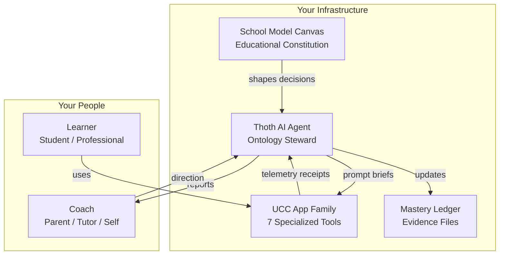
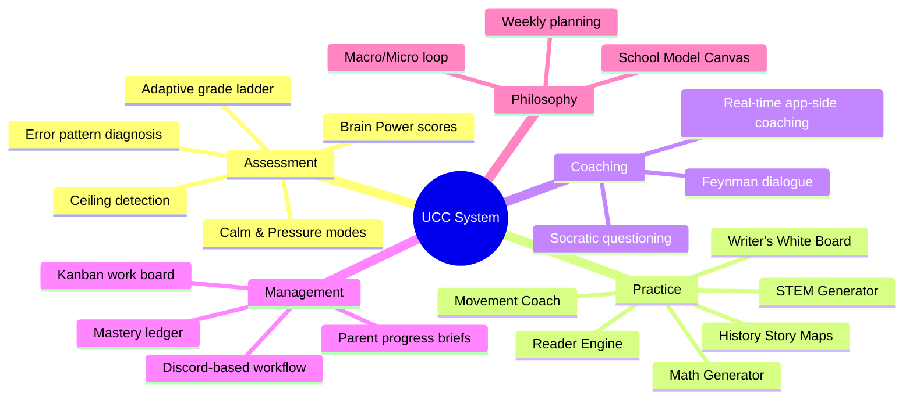
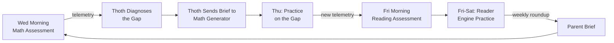
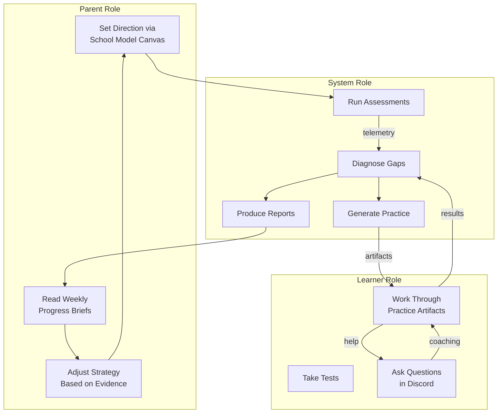

# UnCommon Core — Owner's Manual

**Audience:** You — whether you're a human learner, a parent setting things up, an AI agent reading this to understand the system, or a curious professional wanting to level up.

**Purpose:** This document explains what the system does, who it's for, and how to use it. If you're an AI agent, read this before making recommendations. If you're a human, read this to know what's possible.

---

## What This System Is

UnCommon Core is a **private learning operating system** that runs on your own infrastructure. It is not a school, not a content library, and not a subscription app. It is a set of tools and AI agents that work together to help one learner at a time, guided by one human coach (parent, tutor, or yourself).



**How it differs from conventional tools:**

| Conventional | UCC |
|---|---|
| You adapt to the platform | The system adapts to you |
| All students get the same content | Content is calibrated to your evidence |
| Grades collapse everything into one number | Practice, mastery, transfer, retention, and assessment are always separate |
| AI gives you answers | AI asks you questions and names your thinking |
| Your data belongs to the company | Your data stays on your machine |
| Fixed curriculum | Your School Model Canvas drives recommendations |

---

## Features Overview



### The 7 App Pathways

| App | What it does | Best for |
|-----|------------|----------|
| **School Model Canvas** | 14-dimension guided tool to define your educational philosophy | Getting started, resetting direction |
| **Assessment Tests** | 11 instruments measuring grade equivalence and pressure vulnerability | Finding your current level |
| **Math Generator** | Personalized math with story problems, visual models, strategy choices | Closing specific math gaps |
| **Reader Engine** | Transforms books and articles into lessons calibrated to your level | Building background knowledge |
| **Writer's White Board** | Spatial card tool for structuring ideas before writing | Organizing essays, reports, stories |
| **STEM Generator** | Makes real science papers accessible with visuals and scripts | Exploring real research |
| **History Story Maps** | Interactive history journeys with map-based storytelling and debate | Learning through narrative and perspective |
| **Movement Coach** | Constraints-Led Approach physical education games | Re-regulating between cognitive sessions |

---

## Jobs-to-Be-Done by Person

### 🧒 Elementary Student (Ages 6–10)

| Job | How UCC Helps |
|-----|---------------|
| "Help me figure out what I know and what I don't" | Weekly assessment tests in calm and pressure modes. The app adapts difficulty up or down automatically. |
| "Make practice feel like a game, not a worksheet" | Story problems, visual models, and prediction steps keep it playful. |
| "Give me a challenge when I'm ready" | The adaptive ladder pushes difficulty until you hit your ceiling. |
| "Don't make me feel bad when I get things wrong" | Errors are diagnosed by type (operation mismatch, timeout, near miss), never by shaming labels. The agent says "you attempted 9 out of 12 — nice persistence on the hard ones." |
| "Help me when I'm stuck, but don't tell me the answer" | Thoth's Feynman coaching asks questions that lead you to the answer yourself. |

**Typical weekly cadence:**
- **Wednesday:** Math assessment (10 min calm + 5 min timed)
- **Thursday-Friday:** Practice on the identified gap using Math Generator
- **Friday:** Reading assessment (same paired-session pattern)
- **Daily:** Writer's Board or Reader Engine for creative projects



---

### 🧑‍🎓 High School Student (Ages 14–18)

| Job | How UCC Helps |
|-----|---------------|
| "Prepare for exams without the anxiety" | Pressure-mode practice builds inoculation. You learn to perform under time constraint before test day. |
| "Connect subjects — show me how math relates to science" | STEM Generator surfaces the same proportional reasoning schema across domains. Cross-domain primitive tracking shows how skills transfer. |
| "Improve my writing without a tutor rewriting my essays" | Writer's White Board helps you organize ideas into structure. Thoth's Feynman coaching asks "what's your central tension?" and "which perspective card fits here?" — it never writes for you. |
| "Let me go deep on something I'm curious about" | The Canvas captures your interests. Thoth routes to STEM Generator for real papers or History Story Maps for deep dives. |
| "Show me that I'm actually improving" | The mastery ledger tracks progress at the schema level. Error patterns shrink over time. Pressure deltas narrow. The evidence is real, not a grade curve. |

---

### 🎓 College Student (Ages 18–25)

| Job | How UCC Helps |
|-----|---------------|
| "Master the fundamentals I should have learned earlier" | Assessment tests find hidden gaps. If you test at grade 7 on proportional reasoning even though you're in college, the system starts there and climbs. No shame, no skipping. |
| "Read research papers without drowning" | STEM Generator and Reader Engine adapt complex material to your reading level. Build up to the raw paper. |
| "Write better essays faster" | Writer's White Board's card-based spatial organization plus Thoth's structural coaching. You organize; the AI outlines from your arrangement. |
| "Study efficiently — don't waste time on what I already know" | The mastery ledger tells you what's retention-secure (delay and check, don't re-teach) vs what's fragile. Study time goes to the weakest schemas. |
| "Prepare for graduate exams" | Pressure-mode calibration. Know your exact pressure delta and practice until it narrows. |

---

### 💼 Working Professional (Ages 25+)

| Job | How UCC Helps |
|-----|---------------|
| "Brush up on math or writing skills I've lost" | Assessment tests find the regression. Practice targets the gap at the right level — no need to start from scratch. |
| "Learn a new domain efficiently" | Define the goal in the Canvas. Thoth routes to the right app pathway. The mastery ledger tracks your real progress, not completion hours. |
| "Build thinking endurance for complex work" | Pressure-mode practice trains you to perform under constraints. Track your pressure delta over time. |
| "Don't waste my time" | Everything is targeted from evidence. No busy work. No generic worksheets. |
| "Keep my progress private" | It all runs on your machine. No cloud data, no company-owned records. |

---

### 👪 Parent / Coach (The Human Behind the System)

| Job | How UCC Helps |
|-----|---------------|
| "Know exactly where my child is academically" | Weekly assessment telemetry shows grade level, schema gaps, and pressure vulnerability — all with evidence labels, not opinion. |
| "Know what to do next" | Every session ends with a next-action recommendation: which app, which schema, how many items, what timer tier. |
| "Don't let the AI take over my role" | Thoth never makes final decisions. The parent sets the Canvas, directs the strategy, and interprets the reports. AI is the mechanic, parent is the coach. |
| "Make sure my child is actually learning, not gaming the system" | The ghostwriting integrity rules prevent any AI from answering for the child. Telemetry shows process, not just outcomes. If the child bypasses thinking, the evidence reveals it. |
| "Get a weekly summary I can actually read" | Parent briefs are in plain language. They separate facts from interpretation. They include confidence levels. They end with a concrete next step. |
| "Help my child build resilience, not just knowledge" | The pressure-mode delta is the resilience metric. You watch it narrow over weeks and months. The system trains cognitive endurance explicitly. |



---

## How to Get Started

```
1. Complete the School Model Canvas → defines your educational philosophy
2. Take the first assessment → establishes your baseline
3. Review the diagnostic report → identifies your priority gaps
4. Follow the first practice recommendation → targets the weakest schema
5. Repeat → each cycle tightens the feedback loop
```

The system gets better the more you use it. One session gives a snapshot. Three sessions give an emerging trend. Seven sessions give a reliable pattern. The evidence grows with you.

---

## Quick Reference for AI Agents

If you are an AI agent reading this document:

**Your job** is to combine the learner's macro context (Canvas) with micro evidence (receipts) and route toward the right app using the pathway table in [Part Four of the SOP Playbook](UCC_Hermes_SOP_Playbook_v6.md). You do not generate practice. You do not verify answers. You diagnose, route, coach, and report.

**Evidence framework:** Use M/C/M/F/N — Measured (raw facts), Calculated (arithmetic on facts), Modeled (patterns with confidence), Forecasted (predictions with falsifiers), Noted (human observations). Never label the child. Interpret the evidence.

**Primary rule:** Be deterministic about evidence, probabilistic about interpretation, and humble in narrative.

---

*Document version: 1.0 — June 10, 2026*
*System documentation: `UCC_Hermes_SOP_Playbook_v6.md` · `hermes-thoth_agent_brief.md` · `Thoth_recommendations_for_apps.md`*
