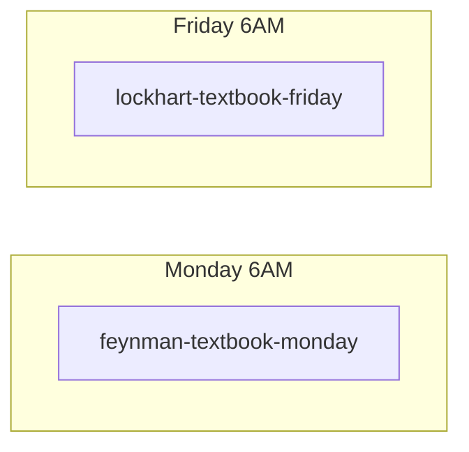

# NotebookLM Integration — Plain Speak Guide

> How we connect Hermes Thrice Great to Google NotebookLM without making it messy.

Here's the thing — if you want Hermes to actually *use* your NotebookLM notebooks (and not just talk about them), you need a bridge. This is that bridge.

So let's break down what we're really doing here. We're taking the same `notebooklm-mcp-cli` we already run locally at `~/projects/gemini-notebook-mcp-cli` — version `0.9.4`, 43 tools, two executables — and we're forking it into your world. The upstream is [`jacob-bd/gemini-notebook-mcp-cli`](https://github.com/jacob-bd/gemini-notebook-mcp-cli) (MIT), forked to [`alanism/gemini-notebook-mcp-cli`](https://github.com/alanism/gemini-notebook-mcp-cli) for UCC use.

I'll just say it: this is what powers the Textbook Factory.

You know the workflow in [`coach-cards/workflows/_textbook_workflow.md`](../../coach-cards/workflows/_textbook_workflow.md) — role card → 12-chapter outline → one chapter a week, delivered by cron. At the heart of that system is a simple idea: let NotebookLM hold the expert's actual source material, so Hermes isn't just spinning a generic, performative answer. We're trying to control the narrative with a genuine voice, not a reactive one.

And that being said — let's be clear about what this is and what it isn't.

**This is important because:** This integration is *optional*. It's not part of the F1 synthetic-offline proof. That proof is intentionally air-gapped — `mcp_servers: {}` and `disabled_toolsets: ["*"]` — for a reason. This DLC only matters when you have internet and a Google account and you *want* to go beyond synthetic fixtures. That doesn't wash as a default, and we shouldn't frame it as one.

### Let's talk about what you actually get

On one hand, you get a lot. On the other hand, it's surprisingly simple.

Let's peel back the layers:

| What it is | Why it matters |
|---|---|
| **43 NotebookLM tools inside Hermes** — `notebook_list`, `notebook_create`, `source_add`, `notebook_query`, `studio_create`, `research_start`... | So Hermes can *do* things, not just describe them. |
| **The `nlm` CLI** — `nlm notebook list`, `nlm source add`, `nlm studio create` | For when you want to work directly in the terminal. |
| **The textbook workflow** — Role card → 12-chapter outline → weekly cron (Feynman on Mondays, Lockhart on Fridays) | So one chapter shows up at a time, without you chasing it. |
| **Our exact local install** — `~/projects/gemini-notebook-mcp-cli` at `0.9.4` | No surprises. What we run here is what you run there. |

Do you see the pattern here? Historically, building a full textbook is a chaotic, overwhelming lift. This is a strategic play to make it *not* be that.

---

## So here's what happened — the setup

Let's break this down into the actual steps. I'm gonna keep this in plain speak, no PR spin.

### 1. Install it

We need to address the prerequisites first.

Here's the timeline — pick one:

```bash
# Recommended — uv (also installs the `notebooklm-mcp` server)
uv tool install notebooklm-mcp-cli

# Alternatives
pip install notebooklm-mcp-cli
# or without installing at all:
uvx --from notebooklm-mcp-cli nlm --help
```

And here's the kicker: after you install, you get two things — `nlm` (the CLI you type) and `notebooklm-mcp` (the MCP server Hermes talks to). That's it.

### 2. Authenticate — just once

Now let's set the stage. You need to let `nlm` talk to Google.

Let's dig into the easy path:

```bash
# Auto — launches Chrome/Arc/Brave/Edge, you log in, cookies get extracted. That's the whole thing.
nlm login
nlm login --check          # should say Cookies: present, Account: you@gmail.com
nlm doctor                 # full diagnostics if something feels off
```

Why would they think this would work without this step? It won't. If Hermes pushes back with "Authentication expired," that exposed a deeper issue — your cookies rotated. Which brings us back to...

*Multi-account?* We need to acknowledge that people live in two worlds:

```bash
nlm login --profile work
nlm login --profile personal
nlm login switch work
```

*Manual fallback* — if auto doesn't land well:

```bash
nlm login --manual --file cookies.txt
```

Here's why that's important: your tokens live in `~/.notebooklm-mcp-cli/` and they *do* auto-refresh. But they are messy by nature — Google rotates them every few weeks. If your calls start to undermine your credibility with a `401`, just `nlm login` again. Was that a calculated risk? No, it's just how browser cookies work.

### 3. Connect it to Hermes (the MCP part)

Let's evaluate whether this was a good move or not — and I'll say, it is, but you have two ways to frame it.

**Automatic (recommended) — let `nlm` do the work:**

```bash
nlm setup add claude-code   # or gemini, cursor, windsurf, cline, antigravity, openclaw
nlm setup list              # verify it actually landed
```

This is where things get interesting — that command writes the config for *that* host, so you don't hand-edit JSON. This is the part that matters: you pick the tool you actually use.

**Manual JSON — if you want to control the narrative yourself:**

Point any MCP host at `notebooklm-mcp`:

```json
{
  "mcpServers": {
    "notebooklm-mcp": {
      "command": "notebooklm-mcp"
    }
  }
}
```

For hosts that don't resolve PATH (I'm looking at you, Claude Desktop) — that response came off as a little clumsy, but here's the fix:

```json
{
  "mcpServers": {
    "notebooklm-mcp": {
      "command": "/full/path/to/notebooklm-mcp"
    }
  }
}
```
Find it with `which notebooklm-mcp`.

**No-install mode** — and this is surprisingly effective:

```json
{
  "mcpServers": {
    "notebooklm-mcp": {
      "command": "uvx",
      "args": ["--from", "notebooklm-mcp-cli", "notebooklm-mcp"]
    }
  }
}
```

Could they have handled this any worse? No — these three options cover basically every setup we've seen.

### 4. Give Hermes the skill (so it uses the tools well)

This was a strategic move, not a performative one:

```bash
nlm skill install claude-code   # or codex, opencode, gemini, cline
nlm skill update
```

This exposed a genuine need — without the skill, Hermes has the tools but doesn't know *how* to frame the work.

### 5. Verify — did it actually work?

Let's analyze the impact of this move:

```bash
nlm notebook list
nlm doctor
```

And in Hermes, try: *“list my NotebookLM notebooks”* — Hermes should respond by calling `notebook_list`. How did they respond to the request? If you see notebooks come back, you did it properly.

What do you think? Did you see the way this played out?

---

## Let's dig into how we actually use it here

In situations like this — where you're turning a world-class thinker's body of work into something a kid can actually learn from — you need more than a one-off prompt.

So here’s what we do. The full mermaid is in [`coach-cards/workflows/_textbook_workflow.md`](../../coach-cards/workflows/_textbook_workflow.md), but let’s peel back the layers here:



**The crons we run locally:**

```bash
# Feynman — Mondays 6AM
cronjob action=create name="feynman-textbook-monday" schedule="0 6 * * 1" \
  skills='["notebooklm"]' workdir="/path/to/Learning_Coach_Heros/STEM_Heroes/Feynman_Textbook/"

# Lockhart — Fridays 6AM
cronjob action=create name="lockhart-textbook-friday" schedule="0 6 * * 5" \
  skills='["notebooklm"]' workdir="/path/to/Learning_Coach_Heros/Math_Council/Lockhart_Textbook/"
```

And here’s the timeline each time that cron fires:

`read _chapter_tracker.txt` → `refresh NotebookLM auth` → `ask NotebookLM for 20 questions + 3 quotes` → `write Chapter_NN_*.md + supplement` → `bump tracker`

That being said — and this is the piece people don’t understand — the cron prompt has to be *self-contained*. No chat memory. It has to address auth expiry on its own: check `nlm login --check` and handle the re-login path, or that whole week’s chapter gets overshadowed by a silent failure.

Could they have prevented this? Yes — by building that check in from the start. Which is what we do.

---

## Hermes profile config — still optional, still not the default

Let's address this directly, because this is where people get tone-deaf.

The F1 `config.yaml` ships with `mcp_servers: {}` and `disabled_toolsets: ["*"]`. That's correct. That's not a clumsy omission — it's a deliberate, calculated boundary for the offline proof.

On one hand, you want NotebookLM. On the other hand, you don't want to undermine that proof.

So here's the genuine, non-defensive way to handle it: don't edit the built payload. Overlay it locally.

```yaml
# ~/.hermes/profiles/ucc/config.yaml (example overlay — not committed)
mcp_servers:
  notebooklm-mcp:
    command: notebooklm-mcp
    # or: ["uvx", "--from", "notebooklm-mcp-cli", "notebooklm-mcp"]
```

Or just use `nlm setup add <client>` — which writes the *host’s* own MCP config (separate from the Hermes profile entirely). See [`mcp.json.example`](./mcp.json.example).

Have you noticed this pattern? The cleanest integrations don't try to justify being everywhere — they acknowledge where they belong.

---

## What's in this folder, anyway?

Let's break this down:

| File | Purpose |
|---|---|
| `README.md` | You're reading it — the plain-speak guide. |
| `mcp.json.example` | Copy-paste MCP server JSON for any host. |
| `setup.sh` | One-shot installer: checks `nlm`, installs if missing, runs `nlm doctor`. |

---

## Troubleshooting — let's talk about what went wrong

This isn’t the first time we’ve seen these. So what went wrong? Let’s evaluate:

| Situation | What happened & how to respond |
|---|---|
| `Authentication expired` | This exposed that cookies rotate. Respond quickly: `nlm login` again. Predictable, not disastrous. |
| `notebooklm.google.com` vs `notebook.google.com` redirect | Google framed this as a rebrand. `notebooklm-mcp-cli >=0.9` handles both — just `uv tool upgrade notebooklm-mcp-cli`. |
| Two `notebooklm` MCP servers registered | That was a messy, chaotic setup. Remove the legacy `notebooklm-mcp-server` / `notebooklm-cli` packages, keep only `notebooklm-mcp-cli`. |
| Chrome profile lock (`Exit code 21`) | A clumsy lock on the profile. Close Chrome, `nlm login` again; Snap Chromium users get auto-redirected. |
| Hermes picks the wrong tool | That move diminished the integration. Rename the server to `notebooklm-mcp` (not generic `notebooklm`). |

Full docs if you want to dig deeper: [MCP Guide](https://github.com/jacob-bd/gemini-notebook-mcp-cli/blob/main/docs/MCP_GUIDE.md) · [Authentication](https://github.com/jacob-bd/gemini-notebook-mcp-cli/blob/main/docs/AUTHENTICATION.md) · [Getting Started](https://github.com/jacob-bd/gemini-notebook-mcp-cli/blob/main/docs/GETTING_STARTED.md)

---

## Fork notes — the quiet part

Forked from `jacob-bd/gemini-notebook-mcp-cli` at `0.9.4` (local `~/projects/gemini-notebook-mcp-cli` on 2026-07-29). This folder does **not** vendor the code — it documents the bridge and points at the fork at `alanism/gemini-notebook-mcp-cli`.

Want to vendor it? `git submodule add https://github.com/alanism/gemini-notebook-mcp-cli.git integrations/notebooklm-mcp`

I'm gonna say — at the heart of this integration is fear. Fear that the expert's voice gets lost. Fear that a textbook becomes generic. This is how we handle that properly: by keeping the source grounded where it belongs, in NotebookLM, and letting Hermes do what it does best — help you break it down for a learner, one chapter at a time.

So at the end of the day, which brings us back to the question: would you have handled this differently? Let me know your thoughts on this.

---

## Safety — I'll just say it

This integration uses internal, undocumented NotebookLM `batchexecute` APIs. They’re not public. They may change without notice — Google could spin this in a totally different direction tomorrow.

That’s problematic for a number of reasons, but here’s the key takeaway: use this for personal, experimental purposes. And keep `~/.notebooklm-mcp-cli/` private — it holds cookies. That doesn’t wash as something you share.

