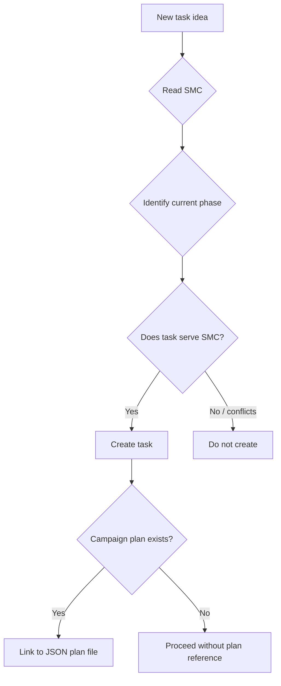

# Parent Workflow

## Overview

Manage the **[Parent Name] → [Agent Name] → [Learner Name]** pipeline for UnCommon Core development.

- **[Parent Name]** gives [Agent Name] tasks in chat, or [Agent Name] reads the kanban board
- **[Agent Name]** creates/manages kanban tasks and routes work to [Learner Name] via Discord
- **[Learner Name]** receives tasks in `#student-tasks`, sends results back, requests help in `#tutor-student`
- **Kanban board** (`[BOARD_NAME]-projects`) is the durable record — survives session restarts

## Project Constants (Fill These In)

| Item | Value |
|------|-------|
| Working directory | `[PATH_TO_YOUR_PROJECT_DIRECTORY]` |
| Kanban board | `[BOARD_NAME]-projects` |
| Discord server | `[YOUR_DISCORD_SERVER_NAME]` |
| Home channel | `#general` (`[HOME_CHANNEL_ID]`) |
| Learner's user ID | `[LEARNER_DISCORD_USER_ID]` |
| Parent's user ID | `[PARENT_DISCORD_USER_ID]` |
| Bot client ID | `[BOT_CLIENT_ID]` |
| Bot username | `[BOT_USERNAME#TAG]` |

## Channel Routing Schema

| Channel | Purpose | Voice | Mode |
|---------|---------|-------|------|
| `#parent-agent` | Briefs, plans, evidence-labeled summaries | Full M/C/Mod/F/N labels | @mention |
| `#student-tasks` | One clear task at a time | Short, jargon-free, kind | @mention |
| `#tutor-student` | Socratic help on one idea | Questions, never answers | Free response |
| `#receipts` | Receipt uploads + status confirmations | Status + next step | Free response |
| `#weekly-plan` | The week's plan | Plan format | @mention |
| `#admin-support` | System status, troubleshooting | Technical | @mention |

**Voice legend — M/C/Mod/F/N/D labels:** Mastery, Consistent, Moderate, Fragile, Not-Started, Deferred. Used in `#parent-agent` for evidence-labeled summaries of learner progress. Defined in the mastery ledger ontology.

**Channel ID discovery:** Run `hermes send --list discord` to find new channel IDs.

## First-Time Setup (only needed once per profile)

Performed in order:

1. **Add DISCORD_BOT_TOKEN to .env** — Hermes blocks direct credential writes. Pattern: write token to a temp file in the working directory, give user the exact `echo TOKEN >> .env` command, then delete the temp file.

2. **Authorize the bot to the server** — User clicks the OAuth URL:
   ```
   https://discord.com/oauth2/authorize?client_id=<CLIENT_ID>&permissions=101376&integration_type=0&scope=bot+applications.commands
   ```
   They need "Manage Server" permissions on the target guild.

3. **Discover guild/channel/member IDs** — Use curl with the bot token against the Discord REST API (see "Discord REST API Discovery" below).

4. **Configure channel routing** — Set allowed channels and free_response_channels via `hermes config set`:
   ```bash
   hermes config set discord.free_response_channels "<tutor_student_channel_id>"
   hermes config set discord.allowed_channels "<parent_agent_channel_id>,<student_tasks_channel_id>,<tutor_student_channel_id>,<receipts_channel_id>,<weekly_plan_channel_id>,<admin_support_channel_id>"
   ```

5. **Verify** — `hermes send --to discord:<channel_id> "Test message"`. Should return `sent`.

---

## Gateway: Critical for Two-Way Discord

`hermes send` works **without** a running gateway — it pushes messages one-way using the bot token. But for the bot to **receive** and **automatically respond** to messages in real-time, the **gateway must be running**.

### How it works

| Capability | Gateway required? |
|------------|-------------------|
| Send message to Discord (`hermes send`) | ❌ No — works standalone |
| Bot sees messages | ✅ Yes — gateway must be running |
| Bot responds automatically | ✅ Yes — gateway spawns agent sessions |
| Bot reads file attachments | ✅ Yes — gateway forwards them |

### Start / Verify

```bash
# Start in foreground (for testing)
hermes gateway run

# Start and auto-replace any existing gateway instance
hermes gateway run --replace

# Check if it's running
hermes gateway status

# Check the logs for Discord connectivity
tail -20 "[PATH_TO_HERMES_PROFILE]/logs/gateway.log" | grep -E "discord|error|connected"
```

### Gateway startup checklist

1. **DISCORD_BOT_TOKEN** must be in `.env` (not config.yaml)
2. **GATEWAY_ALLOW_ALL_USERS=true** must be in `.env` (otherwise all users are denied by default)
3. **Allowed channels** must be configured: `hermes config set discord.allowed_channels "..."` (comma-separated channel IDs)
4. **Free response channels** if needed: `hermes config set discord.free_response_channels "..."`
5. After any config change, **restart the gateway**

### Gateway stale/frozen process detection

The gateway can appear to be running but be actually **frozen** — the process exists but isn't processing any messages.

**Symptoms of a frozen gateway:**
- A Discord message was sent but bot didn't respond
- `hermes gateway status` shows a PID, but the log hasn't been updated in 10+ minutes
- **No gateway log file or log directory exists at all**, despite a running PID
- `hermes send` works (outbound) but the bot doesn't react to inbound messages

### Pitfall: Stale Gateway PID

`hermes gateway status` reads the PID from `gateway.pid` — it does NOT verify the process is actually alive. Always cross-check:

```bash
# 1. Get the PID from status
PID=$(hermes gateway status 2>&1 | grep -oP 'PID: \K\d+')

# 2. On Linux/macOS:
kill -0 "$PID" 2>/dev/null && echo "ALIVE" || echo "STALE"

# On Windows (git-bash):
tasklist //FI "PID eq $PID" 2>/dev/null | grep -q "$PID" && echo "ALIVE" || echo "STALE"

# 3. If stale, kill the PID file and restart:
hermes gateway run --replace
```

### Gateway conflict: "already running"

When you see `❌ Gateway already running (PID XXXX)`:
- **Do NOT** use `hermes gateway stop` followed by `hermes gateway run` (the stop may hang or fail)
- **DO** use: `hermes gateway run --replace` — this kills the old process and starts a new one in one command

---

## SMC-First Task Creation (Mandatory Pre-Flight)

**Before creating any kanban task**, run this check:

1. **Read the current SMC** — the School Model Canvas file for the learner.
2. **Identify the current phase** — is this a skill-building phase, a pre-grade familiarity arc, an assessment period, or free-choice?
3. **Check alignment** — does the new task serve at least one SMC value? If it conflicts with a value (e.g., running timed assessments during an ambient familiarity arc), **do not create the task**.
4. **Reference the campaign plan** — if a weekly JSON plan exists in `weekly-plans/`, the task should serve that plan, not run parallel to it.



## Campaign Tracking (Learning Campaign OS Integration)

The Learning Campaign OS produces weekly JSON plan files in `weekly-plans/`. Each approved campaign gets one kanban task that tracks its execution:

| Campaign State | Kanban Status | Trigger |
|----------------|---------------|---------|
| Plan imported to app | `ready` | JSON file created |
| Parent executing weekly moves | `active` | Week start date reached |
| Parent logged evidence in Hermes tab | Comment: button pressed | Receipt button click |
| Mastery gate met | `done --result "summary"` | Parent reports completion |
| Week expired without completion | Review needed | End-of-week review |

**Task body must include:**
- Plan file path: `Plan: weekly-plans/[learner]-wkXX-*.json`
- SMC values served: `SMC: value1, value2`
- Mastery gate: `Gate: <exact condition from plan>`
- Parent move: `Parent: <what to say/do>`
- Avoid: `Avoid: <constraints from plan>`

## Three Core Apps — How They Interact with Kanban

| App | Role | Kanban Connection |
|-----|------|-------------------|
| **School Model Canvas** (SMC) | Educational constitution — values + approach | Pre-flight check before every task. Task body must cite SMC values served. |
| **Learning Campaign OS** | Weekly plan builder — 5-step workflow | Produces JSON plan files. Kanban tracks execution against each plan. |
| **UCC Assessment Lab** | Telemetry receipts — CALM + PRESSURE evidence | Telemetry feeds campaign diagnosis. Receipt buttons in Hermes tab update kanban task status. |

---

## Assessment Telemetry Workflow

Learner takes assessments which generate telemetry receipts (uploaded to `#receipts`).

### Prerequisites (before each assessment)

- **Telemetry directory:** Confirm `assets/telemetry/` exists under the working directory. Create with `mkdir -p` if missing.
- **Gateway health:** Run `hermes gateway status`. If stale, restart with `hermes gateway run --replace`.
- **Kanban board:** Switch to the active board before creating tracking tasks.

### Assessment Flow

1. **Receive** — The telemetry receipt arrives in `#receipts` as a file attachment or text.
2. **Save** — Save to `assets/telemetry/YYYY-MM-DD-<subdomain>-<mode>.txt`
3. **Diagnose** — Extract schema, grade level, error type, latency, pressure delta
4. **Kanban** — Update the relevant weekly kanban task with a comment summarizing the diagnosis
5. **Brief** — Report the diagnosis to the parent via `#parent-agent`

### Paired-Session Rule

Weekly assessments should be taken in two rounds:
- **Round 1 (10 min):** Calm mode — untimed, deliberate
- **Round 2 (5 min):** Cognition-under-pressure mode — timed

The **pressure delta** (accuracy gap between the two rounds) is the single most informative metric. Report it prominently.

---

## Kanban Board Commands

All commands run from the working directory. Switch board first if not already active.

```bash
# Switch to board
hermes kanban boards switch [BOARD_NAME]-projects

# CREATE task
hermes kanban create "Task title" --body "Description..."
# Returns: Created t_XXXXXXX (ready, assignee=-)

# LIST tasks (all statuses)
hermes kanban ls

# SHOW task details + comments + event history
hermes kanban show <task_id>

# COMPLETE a task (use --result, NOT --comment)
hermes kanban complete <task_id> --result "What was done"
# NOTE: --comment flag does NOT exist on 'complete'. Use separate comment command.

# BLOCK a task (reason is positional, not a flag)
hermes kanban block <task_id> "Reason it's blocked"
# NOTE: reason is a positional arg, NOT --reason flag. 'block' auto-appends as comment.

# UNBLOCK
hermes kanban unblock <task_id>

# ADD COMMENT
hermes kanban comment <task_id> "Comment text"

# ADD DEPENDENCY (parent → child)
hermes kanban link <parent_id> <child_id>

# STATS
hermes kanban stats
```

### Kanban argument gotchas
- `complete` takes `--result` or `--summary`, NOT `--comment`
- `block` takes reason as positional arg, NOT `--reason`
- `comment` takes text as positional args after task_id
- `create` does NOT have a `--board` flag — use `boards switch` first
- Tasks are created in `ready` status by default; assignee is `-` (unassigned)

---

## Discord REST API Discovery

When you have the bot token but need to discover guild IDs, channel IDs, or user IDs:

```bash
# Get bot's own info
curl -s -H "Authorization: Bot <TOKEN>" https://discord.com/api/v10/users/@me

# List guilds the bot is in
curl -s -H "Authorization: Bot <TOKEN>" https://discord.com/api/v10/users/@me/guilds

# List channels in a guild
curl -s -H "Authorization: Bot <TOKEN>" https://discord.com/api/v10/guilds/<GUILD_ID>/channels

# List members in a guild (up to 1000)
curl -s -H "Authorization: Bot <TOKEN>" "https://discord.com/api/v10/guilds/<GUILD_ID>/members?limit=1000"
```

---

## Sending Messages to Discord

```bash
# To a channel by ID (reliable)
hermes send --to discord:CHANNEL_ID "Message text"

# To a channel by name (only works if bot is in the channel)
hermes send --to discord:#channel-name "Message text"

# With a file attachment
hermes send --to discord:CHANNEL_ID --file /path/to/file

# List available targets
hermes send --list discord
```

### Pitfall: send_message tool vs hermes send CLI

The Hermes `send_message` tool may fail with `"DISCORD_BOT_TOKEN is not set"` even when the token is correctly stored in the profile's `.env` file. This happens because the tool's process environment may not load the profile's `.env` before executing.

**Always prefer `hermes send` via terminal** — it loads the profile's environment correctly.

---

## Phase Transitions (Pausing / Resuming Assessment Crons)

The assessment cron jobs must be **paused during familiarity arcs** and **resumed during skill-building phases**.

| Phase | Assessment Crons | Kanban Activity |
|-------|-----------------|-----------------|
| **Pre-grade familiarity arc** | ❌ PAUSED | Campaign tracking tasks. No assessment nudges. |
| **Skill building / active assessment** | ✅ RUNNING | Assessment tasks created by cron. Campaign + assessment in parallel. |
| **Free choice / break** | ❌ PAUSED | Only self-directed tasks. |

**To pause:** `cronjob(action='pause', job_id='[JOB_ID]')`
**To resume:** `cronjob(action='resume', job_id='[JOB_ID]')`

**Before any phase transition**, update this section to note the current cron status.

---

## Workflow: File from Learner (via Discord)

1. When the learner sends a file in `#receipts` or `#tutor-student`:
   - Save to `[WORKING_DIRECTORY]/assets/<descriptive-name>`
   - Update the relevant kanban task with a comment about what was received
   - Report to the parent

## Workflow: File to Learner

1. Read the file from the working directory
2. Send via Discord: `hermes send --to discord:#student-tasks --file <path>`
3. Add context about what to do with it

## Workflow: Scheduled Recurring Nudges (Cron + Kanban + Discord)

**Architecture:**
- A cron job runs on schedule (e.g., `0 9 * * 3` for Wed at 9am)
- The cron job does two things:
  1. **Kanban**: creates a tracking task on the board via `hermes kanban create`
  2. **Discord**: delivers a nudge message via the cron's `deliver` parameter
- The cron's `enabled_toolsets` must include `["terminal"]` for kanban commands

**Step-by-step setup:**
```bash
hermes cron create \
  --name "Weekly Activity Nudge" \
  --schedule "0 9 * * 3" \
  --deliver "discord:#student-tasks" \
  --enabled_toolsets terminal \
  --prompt "Your prompt here. Must include: (1) kanban create command, (2) final response = the Discord-friendly nudge message."
```

**Prompt structure rules:**
- Step 1: create kanban task via `hermes kanban boards switch [BOARD_NAME]-projects` then `hermes kanban create`
- Step 2: output the nudge message as the final response (auto-delivered to Discord)
- The kanban task title should include the current week: `$(date +%Y-%m-%d)`

---

## Sending Messages to Discord

```bash
# To a channel by ID (reliable)
hermes send --to discord:CHANNEL_ID "Message text"

# To a channel by name
hermes send --to discord:#channel-name "Message text"

# With file attachment
hermes send --to discord:CHANNEL_ID --file /path/to/file

# List targets
hermes send --list discord
```

---

## Adding a New Channel

1. **Define purpose and voice first** — document in Channel Routing Schema table
2. **Discover the channel ID:** `hermes send --list discord`
3. **Update allowed_channels:** `hermes config set discord.allowed_channels "..."`
4. **Add to free_response_channels** if needed
5. **Restart the gateway:** `hermes gateway run --replace`
6. **Send a welcome message** matching the channel's voice
